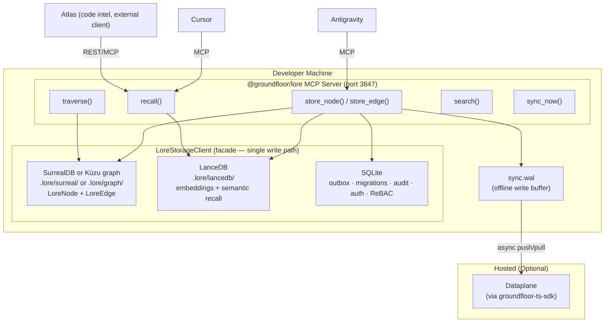

# Groundfloor Lore

> **A knowledge database for Agentic AI — a local-first knowledge graph exposed to any AI tool over MCP**
>
> `@groundfloor/lore`

## Executive Summary

**Lore** is a knowledge database for Agentic AI: a local-first, schema-agnostic memory layer that any AI tool (Claude, Cursor, Antigravity, internal agents) reads and writes over **MCP**. It gives agents **persistent, structured knowledge** of your work — decisions, conventions, documents, systems, people, and history — so they stop rediscovering context from scratch every session.

Lore Core is domain-agnostic. The same engine backs many **workspaces**, each with its own schema and vocabulary: engineering, IT/security, commercial real estate, sales, legal, or personal. Code intelligence is **not** built in — it lives in **Atlas**, one external client application for the software-development domain (see *External clients* below). For the broader product positioning across domains, see [MARKETING.md](MARKETING.md).

The system operates as a **single MCP server** (`@groundfloor/lore`) over three local substrates: **SurrealDB or Kùzu** (embedded graph — SurrealDB by default as of v3.13.0, Kùzu remains fully supported per workspace), **LanceDB** (vector store for semantic recall), and **SQLite** (outbox, migrations, audit, auth, plus application-defined
tabular collections with SQL aggregates). Team-shared knowledge syncs to a hosted **Dataplane** via the Groundfloor TS-SDK.

**Current Status:**

| Component | Status | Details |
|---|---|---|
| Graph substrate (SurrealDB default, Kùzu supported) | ✅ Built | `LoreNode` / `LoreEdge` tables (`engines/surrealGraph.ts`, `engines/localGraph.ts`) |
| Vector substrate (LanceDB) | ✅ Built | Embeddings + semantic recall (`engines/verbatimStore.ts`, `dataplaneVectorStore.ts`) |
| Relational substrate (SQLite) | ✅ Built | Outbox, migrations, audit, auth, plus tabular collections + SQL aggregates |
| `LoreStorageClient` facade | ✅ Built | Single write path; local ↔ Dataplane swap point (`storage/loreStorageClient.ts`) |
| Offline-first sync engine (WAL) | ✅ Built | Local-first push/pull to Dataplane (`engines/syncEngine.ts`) |
| Dataplane sync adapter (TS-SDK) | ✅ Built | `TsSdkAdapter` over `groundfloor-ts-sdk` (`engines/tsSdkAdapter.ts`) |
| Auto-start service management | ✅ Built | Daemon starts on login (LaunchAgent) |

> **Code intelligence is NOT in Core.** Symbol indexing, call chains, and
> blast radius live in the external **Atlas** client (`../groundfloor-atlas/`),
> which talks to Lore over the public REST/MCP API. **Team sync is the hosted
> Dataplane**, reached through `groundfloor-ts-sdk` — there is no SurrealDB and
> no `CodeSymbol`/`CodeRelation` table in Lore Core.

---

## Architecture: Tri-Substrate Database with Local-First Sync

> **Design Decision:** Lore Core is a schema-agnostic database over three
> local substrates — SurrealDB or Kùzu (graph), LanceDB (vector), SQLite (relational) —
> fronted by a single MCP daemon. All writes route through `LoreStorageClient`,
> which is also the cloud-swap point. Team-shared knowledge syncs to a hosted
> Dataplane via the Groundfloor TS-SDK. Local-first: reads are served from
> local substrates and writes are buffered in a WAL, so the network never
> blocks the developer.



### Why a Single Daemon over Three Substrates

| Factor | Rationale |
|---|---|
| One process | One package, one port, one config — `npm i -g @groundfloor/lore && lore setup` |
| Graph (SurrealDB default, Kùzu supported) | Native graph traversal over `LoreNode`/`LoreEdge` (Cypher on Kùzu, SurrealQL on SurrealDB) — "show everything connected to this entity" |
| Vector (LanceDB) | Embedding-backed semantic recall without a separate vector service |
| Relational (SQLite) | Durable outbox, schema migrations, audit log, and auth in one embedded engine |
| Single write path | Every write goes through `LoreStorageClient`, the local ↔ Dataplane swap point |
| Team sync | Offline-first WAL → Dataplane push/pull via `groundfloor-ts-sdk` |

---

## The Problem This Solves

| Pain Point | Impact | How Lore Fixes It |
|---|---|---|
| AI agents re-discover architecture every session | Wastes 10-20 min per session on context loading | Lore recalls conventions, decisions, patterns instantly |
| 14+ repos with no shared knowledge | Tribal knowledge lives in Slack/heads | Lore stores and recalls across all repos and team members |
| No cross-repo dependency visibility | Breaking changes slip through to production | Atlas (external client) shows blast radius before the push, backed by Lore recall |
| Module Federation boundaries are invisible to AI | Shell ↔ Remote app interfaces break silently | Atlas maps what shell exposes vs what remotes consume; decisions stored in Lore |
| `context.yaml` / `.ai-context.md` files go stale | AI uses outdated architecture info | Auto-stored graph nodes replace manual context files |
| StudioBuilder generates without codebase awareness | Generated apps duplicate existing components | Lore recall teaches the generator what already exists |

---

## Lore Core: The Knowledge Graph

This is the whole of Lore Core — a single, schema-agnostic knowledge store. There is no second "pillar"; code intelligence is an external client (see below), not part of Core.

### What It Does

Stores **knowledge** as a **graph of interconnected nodes** — decisions, conventions, documents, systems, people, established patterns — with relationships between them. The same engine serves any domain; the examples below happen to be from software, but a node could equally be a lease, a contract clause, an IAM role, or a customer account. Unlike flat key-value memory, the graph enables traversal: "Show me everything connected to this entity."

### How It Works: Auto-Capture (Zero User Effort)

The AI agent detects knowledge-worthy moments **during normal work** and stores them as a side effect. No explicit user action needed.

**Auto-Capture Triggers:**

| Pattern Detected During Work | What Gets Stored | Node Type |
|---|---|---|
| Bug fix completed | What was broken, what fixed it, why | `bug_pattern` |
| "We decided..." / "Let's go with..." | The decision, alternatives considered, rationale | `decision` |
| Convention established ("always do X") | The convention, scope, enforcement rules | `convention` |
| File created or significantly modified | File purpose, what it connects to | `file_ref` |
| Architecture discussion | Design choice, tradeoffs, constraints | `architecture` |
| Error encountered and resolved | Error signature, root cause, fix pattern | `troubleshooting` |

**Example — What happens when we fix a bug:**

```
You: "Fix the BaaSClient body stream error"

Me: [investigates, finds the bug, fixes it]

Me (internally, automatic — user sees nothing):
    → store_node("baas-body-stream-fix", type="bug_pattern",
        content="Error handler called response.json() then response.text(),
        consuming the body stream twice. Fix: read .text() first, then JSON.parse().")
    → store_edge("baas-body-stream-fix" → "BaaSClient.ts", relation="applies_to")
    → store_edge("baas-body-stream-fix" → "fetch-api-body-stream", relation="caused_by")

Me: "Fixed. The issue was in BaaSClient.ts line 620..."
```

**End-of-session visibility:**
```
📚 Knowledge stored this session:
  • bug_pattern: BaaSClient body stream double-read fix
  • decision: Keep code-intelligence (Atlas) and Memory MCP as separate pillars
  • convention: Admin pages must have demo data fallbacks
```

**Manual override (available but rarely needed):**
```
You: "Remember: never use response.json() followed by response.text()"
You: "Forget the caching decision, we changed our mind"
```

### Data Model: Schema-Agnostic Graph (SurrealDB default, Kùzu supported)

Lore Core declares **only** schema-agnostic node and edge tables. It never
names domain- or application-specific tables (no `CodeSymbol`, no
`CodeRelation`) — those are a client concern. The real DDL lives in
[`packages/lore/src/engines/localGraph.ts`](packages/lore/src/engines/localGraph.ts).

**Directory:** `.lore/graph/` (per workspace, gitignored)

```cypher
-- Knowledge nodes (decisions, conventions, bugs, documents, …)
-- Domain-agnostic: a node could be a lease, a contract clause, an
-- IAM role, or a customer account. Type is just a string.
CREATE NODE TABLE LoreNode (
  id STRING,
  type STRING, label STRING, content STRING,
  tags STRING, project STRING, ecosystem STRING, metadata STRING,
  createdAt STRING, updatedAt STRING, syncedAt STRING,
  security_scopes STRING[],
  -- plus lifecycle/governance columns: legalHold, supersededBy,
  -- ephemeral, ttl_ms, stale, classification, status, … (see localGraph.ts)
  PRIMARY KEY (id)
);

-- Semantic knowledge ↔ knowledge edges. confidence tiers (C1).
CREATE REL TABLE LoreEdge (
  FROM LoreNode TO LoreNode,
  relation STRING,
  confidence STRING DEFAULT 'extracted',
  confidenceScore DOUBLE DEFAULT 1.0
);
```

ReBAC permission edges (owner, editor, viewer, member, parent) are **not**
part of this graph schema. They are SQLite-backed
(`packages/lore/src/security/rebac.ts`, via `better-sqlite3`), kept
distinct from the semantic knowledge graph so permission-check and audit
paths stay independent of graph-substrate swaps (D-023: graph-stored
ReBAC had zero production consumers before this move).

There are **no cross-pillar edges** — Lore Core has one pillar (the
knowledge graph). Code-to-knowledge association is done by the **Atlas**
client storing ordinary `LoreNode`s/`LoreEdge`s (e.g. a `file_ref` node and
an `applies_to` edge) over the public API; Core never stores code symbols.

Traversal example (knowledge only):
```cypher
-- "What's connected to this decision, two hops out?"
MATCH (n:LoreNode {id: $id})-[e:LoreEdge*1..2]->(m:LoreNode)
RETURN m.label, m.type, e
```

### The Three Substrates

All writes go through `LoreStorageClient`
([`packages/lore/src/storage/loreStorageClient.ts`](packages/lore/src/storage/loreStorageClient.ts)),
the facade that fans out to three local engines and is the single local ↔
cloud swap point:

| Substrate | Engine | Holds | Source |
|---|---|---|---|
| **Graph** | SurrealDB (default) or Kùzu (embedded) | `LoreNode`, `LoreEdge`; graph traversal | `engines/surrealGraph.ts`, `engines/localGraph.ts` |
| **Vector** | LanceDB | Per-node embeddings; powers semantic `recall`/`search` | `engines/verbatimStore.ts`, `dataplaneVectorStore.ts` |
| **Relational** | SQLite | Outbox (durable write log), migrations, audit log, auth tokens, ReBAC permission edges | `outbox/`, `security/` |

### MCP Tool Surface (knowledge graph)

These are Lore Core tools — all operate on the knowledge graph. (Code tools
like `query` / `impact` / `context` belong to the **Atlas** client, not Core.)

```
store_node(id, type, label, content, tags?)   → Upsert a knowledge node
store_edge(source_id, target_id, relation)     → Relate two nodes
traverse(node_id, depth=2)                     → Walk the graph
search(query, type?)                           → Vector + keyword search
recall(topic)                                  → Search + traverse combined
get_hot_context()                              → Recently accessed session memory
list_nodes / get_full / mark_stale / supersede_node / delete_node / delete_edge
```

The full surface (74 MCP tools, 80+ REST routes) is enumerated in
[API_REFERENCE.md](API_REFERENCE.md).

### Graph Visualizer Dashboard

Lore includes a built-in interactive web dashboard to visualize the
interconnected knowledge nodes.

- **URL:** `http://127.0.0.1:3847/explore` (when `lore serve --http` is running)
- **Purpose:** Interactive graphical exploration of relationships, node physics modeling, and topology extraction without needing to write Cypher queries.

### Why These Substrates

> **Design Decision:** Use an embedded graph engine (SurrealDB — Kùzu was
> fully removed 2026-08-21, see `docs/KUZU_REMOVAL.md`) for the local
> knowledge graph, LanceDB for vectors, and SQLite for durable relational
> state, all
> behind `LoreStorageClient`. Sync team-shared knowledge to a hosted
> Dataplane via the Groundfloor TS-SDK. Local-first: a WAL buffers writes so
> the network never blocks.

| Component | Database | Rationale |
|---|---|---|
| **Graph** | SurrealDB (default) or Kùzu (embedded) | Zero-process, schema-agnostic node/edge model with native graph traversal |
| **Vector** | LanceDB (embedded) | Embedding store for semantic recall without a separate service |
| **Relational** | SQLite (embedded) | Outbox, migrations, audit, auth, plus tabular collections + SQL aggregates, in one durable engine |
| **Team sync** | Dataplane via TS-SDK | `TsSdkAdapter` implements the `SyncAdapter` interface |
| **Offline buffer** | WAL file (JSONL) | Local writes never blocked on network |

---

## External Clients: Atlas (Code Intelligence) and others

Lore Core stores knowledge for **any** domain. Domain-specific capabilities live in **external client applications** that read and write Lore over the public REST/MCP API — they are not part of Core. Atlas is the reference client for the software-development domain; other clients (legal, CRE, sales, IT/IAM, personal) follow the same pattern.

### Atlas — the code-intelligence client

Atlas indexes **every symbol, call chain, import, class hierarchy, and execution flow** across your repos into a queryable graph, so AI agents understand code structure before making changes.

> **Design Decision (2026-04-30, updated 2026-06-10):** Lore's code-intelligence layer is **Atlas**. Since the v3.11.0 plugin-system removal, Atlas is a **standalone client application** (separate repo, `../groundfloor-atlas/`) that connects to Lore Core over the public REST/MCP API — it is not an in-process plugin and does not live inside this repo. Tree-sitter walkers (8 languages) feed a cross-file resolver and the analytics modules, all inside the Atlas app. License-clean (MIT / Apache / Unlicense dependencies only). Domain logic (code intelligence included) lives in external apps, never in Lore Core.

### MCP Tool Surface

```
query("auth middleware")
→ Finds across ALL indexed repos

impact("AppDataAdapter", upstream)
→ "47 functions across 8 repos depend on AppDataAdapter"
→ Shows exact call chains that will be affected

context("BaaSClient")
→ 360° view: all consumers, all methods, all error paths

detect_changes()
→ Pre-commit blast radius analysis
→ "12 symbols changed. 3 callers in another repo still use old signature."
```

### Multi-Repo Indexing

Lore supports indexing multiple repositories simultaneously. Use `lore init` in each repo to add it to the local graph. The code graph automatically resolves cross-repo call chains and dependency relationships.

---

## Core + an external client, working together

The scenarios below show Lore Core (knowledge graph) working alongside the **Atlas** code-intelligence client. The "Code Graph" steps are Atlas talking to Lore over MCP — not a second pillar inside Core. Scenario 4 shows the same Core serving a non-developer domain with no Atlas involved at all.

### Scenario 1: Modifying `AppDataAdapter` (Core Platform Change)

```
Developer: "Add batch upsert support to AppDataAdapter"

1. Code Graph (Atlas — automatic):
   → impact("AppDataAdapter", upstream)
   → "WARNING: 47 functions across 8 repos depend on AppDataAdapter"
   → Shows exact call chains affected

2. Knowledge Graph (Memory MCP — automatic):
   → recall("AppDataAdapter")
   → Traverses graph → finds:
      • DECISION: "Must maintain backward compat" (2026-03-11)
      • CONVENTION: "Single shared AppDocuments collection, _type discriminator"
      • BUG_PATTERN: "Always scope by _orgId + _appId + _type compound key"

3. Agent writes the change with full awareness, adds backward-compat shim

4. Auto-capture:
   → store_node("batch-upsert-added", type="architecture",
       content="Added batchUpsert() with backward-compat overload")
   → store_edge("batch-upsert-added" → "AppDataAdapter.ts", relation="applies_to")
```

### Scenario 2: Fixing a Bug in `BaaSClient`

```
Developer: "Admin pages are stuck on spinner"

1. Knowledge Graph (automatic):
   → recall("BaaSClient errors")
   → Traverse → finds:
      • BUG_PATTERN: "Body stream double-read. Read .text() first, then JSON.parse()"
      • CONVENTION: "All error handlers must read body exactly once"
   → Instant fix without debugging.

2. Code Graph (automatic):
   → impact("BaaSClient.request()", downstream)
   → "Every admin page calls baasClient.query() → this.request()"
   → "Fix will unblock: UserManagement, ConsumptionPage, PlatformOpsConsole, ..."
```

### Scenario 3: Pre-Commit Safety Net

```
detect_changes() runs before every push:

"12 symbols changed across 4 files
 RISK: HIGH
 - Modified: BaaSClient.query() signature
 - Affected: 47 admin pages, 3 callers in downstream repos
 - Knowledge Graph WARNING: 'BaaSClient.query() is a stable API contract (2026-03-11)'"

→ Agent flags breaking change BEFORE it ships
```

### Scenario 4: A Non-Developer Domain (Commercial Real Estate — no Atlas)

The identical Core, a different workspace shape, no code intelligence in sight:

```
Asset manager (in Claude): "Which leases at the Riverside property expire this quarter,
and is the COI current for each tenant?"

1. Knowledge Graph (Lore Core — automatic):
   → recall("Riverside leases expiring Q3")
   → Traverses graph → finds:
      • LEASE nodes linked to TENANT nodes, expiry dates in metadata
      • Each TENANT linked to its current COI document node (and expiry)
      • DECISION: "Riverside renewals route through Westline Brokerage (2026-02)"

2. Agent answers from structure, not guesswork — names the leases, the contacts,
   and flags the two COIs that lapse before renewal.

3. Auto-capture:
   → store_node("riverside-q3-renewal-review", type="note",
       content="3 leases expire Q3; 2 COIs lapse first; routed to Westline.")
   → store_edge("riverside-q3-renewal-review" → "riverside-property", relation="applies_to")
```

Same engine, same MCP tools, same recall/traverse/store — only the workspace schema and vocabulary differ. That is what "knowledge database for Agentic AI, in any domain" means in practice.

---

## Platform Memory Upgrade: Graph-Aware `memoryService.ts`

### Current State

`memoryService.ts` is a flat key-value store used by **platform AI agents** (chatbots inside client Groundfloor apps — e.g., a property assistant for Colliers).

**File:** [`packages/common/memory/memoryService.ts`](packages/common/memory/memoryService.ts)

```typescript
// Current API Surface
setMemory(input: SetMemoryInput): Promise<string>
getMemory(agentId, key, orgId, userId?): Promise<MemoryEntry | null>
listMemory(agentId, orgId, scope?): Promise<MemoryEntry[]>
deleteMemory(agentId, key, orgId): Promise<void>
```

### Planned Upgrade: Add Graph Edges + Semantic Search

The platform's BaaS data model already IS the domain knowledge graph (Properties → Buildings → Floors → Suites → Tenants). `memoryService.ts` adds **agent learning** on top. The upgrade adds lightweight relationship edges and semantic search without a full graph database rewrite:

```typescript
interface MemoryEntry {
    // ... existing fields (did, agentId, key, value, scope, orgId, etc.) ...

    /** Links to other memory keys for relationship traversal */
    relatedKeys?: string[];

    /** Searchable categories for filtering */
    tags?: string[];

    /** Vector embedding for semantic search */
    embedding?: number[];
}
```

**New API methods (planned):**

```typescript
// Find memories related to a specific memory
getRelatedMemories(agentId: string, key: string, orgId: string, depth?: number): Promise<MemoryEntry[]>

// Semantic search across all memories
searchMemories(agentId: string, query: string, orgId: string): Promise<MemoryEntry[]>

// Tag-based filtering
listMemoriesByTag(agentId: string, tag: string, orgId: string): Promise<MemoryEntry[]>
```

### Two Audiences, Two Systems

| System | Audience | Storage | Purpose |
|---|---|---|---|
| **Lore MCP** | Developers using AI coding tools | SQLite (local) + BaaS (shared) | Architecture decisions, code conventions, bug patterns |
| **memoryService.ts** (upgraded) | Platform AI agents in client apps | BaaS AppDocuments | Agent learning, user preferences, session context |

---

## Key Codebase Files

### Lore Package Structure

| Directory | Purpose |
|---|---|
| `src/engines/` | Local graph engines: SurrealDB default (`surrealGraph.ts`), Kùzu supported (`localGraph.ts`) |
| `src/mcp/` | MCP server implementation (`server.ts`) |
| `src/types/` | Shared TypeScript types |
| `scripts/` | Migration and utility scripts |

---

## Value Per Developer Tier

### Internal Team (Core Developers)

| Capability | Without Lore | With Lore |
|---|---|---|
| Cross-repo awareness | Manual grep across 14+ repos | Code graph instantly shows all callers/consumers |
| Architecture decisions | "I think we decided..." in Slack | `traverse("AppDataAdapter")` returns the full decision chain |
| Bug regression | Same bug fixed differently each time | Graph recalls canonical fix pattern + related context |
| Onboarding | New dev reads 50+ docs over 2 weeks | AI agent has full institutional memory on day 1 |
| Pre-commit safety | Hope nothing breaks | `detect_changes()` flags blast radius before push |

### StudioBuilder / Prompt2Prod (No-Code Clients)

| Capability | Without Lore | With Lore |
|---|---|---|
| Component reuse | AI generates custom components from scratch | Graph: "DataTable already exists in @groundfloor/common" |
| Convention compliance | Generated apps drift from platform patterns | Graph enforces naming, routing, and auth conventions |
| Manifest correctness | Trial-and-error manifest authoring | Code graph shows how manifests map to React components |

### Cloud IDE / Enterprise MF Developers

| Capability | Without Lore | With Lore |
|---|---|---|
| Pattern discovery | Reinvents existing functionality | Code graph: "This pattern already exists in another module" |
| MF contract | Reads federation.d.ts (may drift) | Code graph maps live Module Federation boundary |
| Breaking changes | Ships changes that break the shell | `impact()` + `detect_changes()` shows affected consumers |

---

## Relationship to the Starter Kit

> **The starter kit gives developers the *structure*. The intelligence engine gives them the *institutional knowledge*.**

| Starter Kit Provides | Intelligence Engine Provides |
|---|---|
| Boilerplate `vite.config.ts` with federation setup | "Your shared deps version must match shell: React ^19, Router ^7" |
| Empty `app.manifest.json` template | "Available MDM entity types: VerticalTenant (28 fields), VerticalLease (32 fields)" |
| `@groundfloor/common` alias | "40 named exports available — don't reinvent DataTable, Modal, StatusBadge" |
| Dev server on port 4175 | "Shell host expects remoteEntry.js at `http://localhost:4174/assets/remoteEntry.js`" |

---

## Implementation Roadmap

### Phase 1: Local Tri-Substrate Engine

| Step | What |
|---|---|
| 1 | Graph engine (SurrealDB default, Kùzu supported per workspace) with schema-agnostic `LoreNode` / `LoreEdge` tables (`engines/surrealGraph.ts`, `engines/localGraph.ts`) |
| 2 | LanceDB vector store for embeddings + semantic recall |
| 3 | SQLite for outbox, migrations, audit, and auth, plus tabular collections + SQL aggregates |
| 4 | `LoreStorageClient` facade fronting all three as the single write path |

### Phase 2: Sync Engine (Dataplane)

| Step | What |
|---|---|
| 1 | WAL (write-ahead log) for offline buffering (`engines/writeAheadLog.ts`) |
| 2 | `SyncAdapter` interface; push (local → remote) with upsert semantics |
| 3 | Pull (remote → local) with delta since `.last-sync` |
| 4 | Conflict resolution (last-writer-wins by `updatedAt`) |
| 5 | `TsSdkAdapter` over `groundfloor-ts-sdk` for the hosted Dataplane backend |
| 6 | Background sync timer (default 30s) with health check |

### Phase 3: CLI + npm Package

| Step | What |
|---|---|
| 1 | CLI: `lore init`, `lore serve`, `lore sync`, `lore status`, `lore doctor` |
| 2 | Unified MCP server (code tools + knowledge tools + activity tools) |
| 3 | Auto-configure MCP config on `lore init` |

### Phase 4: Team Awareness

| Step | What |
|---|---|
| 1 | `dev_activity` heartbeat (push modified symbols/files every 5 min) |
| 2 | `who_is_working()` MCP tool |
| 3 | Conflict risk detection (two devs touching same symbol) |

---

## Configuration

### MCP Config (After `lore setup`)

Each IDE uses a different MCP config schema. `lore setup` auto-detects and writes the correct format.

**Cursor** (`~/.cursor/mcp.json`):
```json
{
    "mcpServers": {
        "groundfloor-lore": {
            "type": "http",
            "url": "http://127.0.0.1:3847/mcp"
        }
    }
}
```

**Antigravity** (`~/.gemini/antigravity/mcp_config.json`):
```json
{
    "mcpServers": {
        "groundfloor-lore": {
            "serverUrl": "http://127.0.0.1:3847/mcp"
        }
    }
}
```

> **Key difference:** Cursor uses `type` + `url`; Antigravity uses `serverUrl` (no `type` field).

Optional environment variables for team sync are documented in the setup guide (not tracked in git).

---

## Decisions Log

| Date | Decision | Rationale |
|---|---|---|
| 2026-06-10 | Code intelligence is an external Atlas client, not a Core pillar (v3.11.0) | Lore Core stays a pure schema-agnostic database; Atlas writes knowledge over the public REST/MCP API |
| 2026-03-26 | Single MCP daemon over three substrates (Kùzu + LanceDB + SQLite) | One package, one port, one config; each substrate fits its job |
| 2026-03-26 | All writes through `LoreStorageClient` facade | Single write path and the only local ↔ Dataplane swap point |
| 2026-03-26 | Local-first / offline-resilient design | WAL buffers writes, local substrates serve all reads, network never blocks |
| 2026-03-26 | Pluggable `SyncAdapter`; Dataplane via `TsSdkAdapter` | Swap team-sync backend without code changes; ships over `groundfloor-ts-sdk` |
| 2026-03-25 | Auto-capture with visibility | AI stores knowledge during work; user sees summary at end of session |
| 2026-03-19 | Build memory natively on BaaS (not fork Ogham) | Inherits ReBAC + multi-tenancy; no upstream drift |
