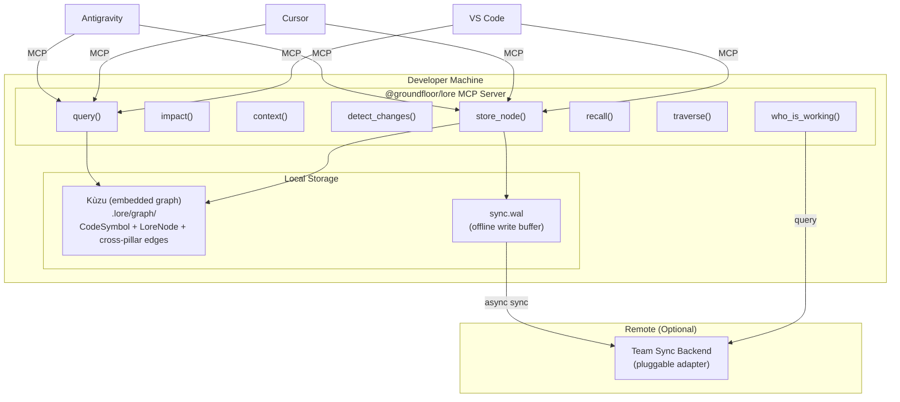

# Groundfloor Lore

> **Persistent Knowledge Graph + Code Intelligence — Unified MCP for AI-Assisted Development**
>
> `@groundfloor/lore`

## Executive Summary

**Lore** is the unified code intelligence and institutional knowledge system for the Groundfloor platform. It gives AI coding tools (Antigravity, Cursor, VS Code Copilot) **persistent institutional knowledge** and **structural code awareness** across all repositories. It eliminates the "cold start" problem where AI agents rediscover architecture every session, and prevents breaking changes by analyzing blast radius before code ships.

The system operates as a **single unified MCP server** (`@groundfloor/lore`) that combines code graph analysis and developer knowledge into one package. Locally, it uses **Kùzu** (embedded graph database) for both code symbols and knowledge nodes. Team-shared knowledge syncs to a centrally hosted **SurrealDB** instance exposed via **Cloudflare Tunnel**.

**Current Status:**

| Component | Status | Details |
|---|---|---|
| Platform Memory (flat key-value) | ✅ Built | `packages/common/memory/memoryService.ts` |
| Developer Knowledge Graph MCP | ✅ Built | SQLite-backed, running as MCP server |
| Code Graph (GitNexus MCP) | ✅ Built | Kùzu-backed, 2,495 symbols indexed |
| Unified Lore Package | 🔨 In Progress | Single `@groundfloor/lore` npm package |
| Unified Kùzu (code + knowledge) | 🔲 Planned | Replace SQLite + Kùzu with single Kùzu graph |
| SurrealDB Hosted (team sync) | 🔲 Planned | Docker + Cloudflare Tunnel |
| Offline-first sync engine (WAL) | 🔲 Planned | Local-first with async push/pull |
| Auto-start service management | 🔲 Planned | MCP server starts on login |

---

## Architecture: Unified MCP with Local-First Sync

> **Design Decision (2026-03-26):** Unify code graph and knowledge graph into a single MCP server and single Kùzu database locally. Use a pluggable sync adapter for team-shared knowledge. Local-first: developer is never blocked on the network.



### Why Unified (Not Separate)

| Factor | Previous (Separate) | Current (Unified) |
|---|---|---|
| Cross-pillar queries | AI agent synthesizes across two servers | **Single graph traversal** — "find decisions about this code" in one query |
| Deployment | Two npm packages, two ports, two configs | **One package, one port, one config** |
| Local database | Kùzu + SQLite (two engines) | **One Kùzu graph** — one query language (Cypher) |
| Team sync | None | Pluggable sync adapter with offline-first WAL |
| Install experience | Multiple steps | `npm i -g @groundfloor/lore && lore init` |

---

## The Problem This Solves

| Pain Point | Impact | How Lore Fixes It |
|---|---|---|
| AI agents re-discover architecture every session | Wastes 10-20 min per session on context loading | Lore recalls conventions, decisions, patterns instantly |
| 14+ repos with no shared knowledge | Tribal knowledge lives in Slack/heads | Lore stores and recalls across all repos and team members |
| No cross-repo dependency visibility | Breaking changes slip through to production | Code graph shows blast radius before the push |
| Module Federation boundaries are invisible to AI | Shell ↔ Remote app interfaces break silently | Code graph maps what shell exposes vs what remotes consume |
| `context.yaml` / `.ai-context.md` files go stale | AI uses outdated architecture info | Auto-stored graph nodes replace manual context files |
| StudioBuilder generates without codebase awareness | Generated apps duplicate existing components | Memory + graph teach the generator what already exists |

---

## Pillar 1: Knowledge Graph (Persistent Developer Memory)

### What It Does

Stores **institutional knowledge** as a **graph of interconnected nodes** — architecture decisions, naming conventions, debugging insights, established patterns — with relationships between them. Unlike flat key-value memory, the graph enables traversal: "Show me everything connected to BaaSClient."

### How It Works: Auto-Capture (Zero User Effort)

The AI agent detects knowledge-worthy moments **during normal work** and stores them as a side effect. No explicit user action needed.

**Auto-Capture Triggers:**

| Pattern Detected During Work | What Gets Stored | Node Type |
|---|---|---|
| Bug fix completed | What was broken, what fixed it, why | `bug_pattern` |
| "We decided..." / "Let's go with..." | The decision, alternatives considered, rationale | `decision` |
| Convention established ("always do X") | The convention, scope, enforcement rules | `convention` |
| File created or significantly modified | File purpose, what it connects to | `file_ref` |
| Architecture discussion | Design choice, tradeoffs, constraints | `architecture` |
| Error encountered and resolved | Error signature, root cause, fix pattern | `troubleshooting` |

**Example — What happens when we fix a bug:**

```
You: "Fix the BaaSClient body stream error"

Me: [investigates, finds the bug, fixes it]

Me (internally, automatic — user sees nothing):
    → store_node("baas-body-stream-fix", type="bug_pattern",
        content="Error handler called response.json() then response.text(),
        consuming the body stream twice. Fix: read .text() first, then JSON.parse().")
    → store_edge("baas-body-stream-fix" → "BaaSClient.ts", relation="applies_to")
    → store_edge("baas-body-stream-fix" → "fetch-api-body-stream", relation="caused_by")

Me: "Fixed. The issue was in BaaSClient.ts line 620..."
```

**End-of-session visibility:**
```
📚 Knowledge stored this session:
  • bug_pattern: BaaSClient body stream double-read fix
  • decision: Keep GitNexus and Memory MCP separate
  • convention: Admin pages must have demo data fallbacks
```

**Manual override (available but rarely needed):**
```
You: "Remember: never use response.json() followed by response.text()"
You: "Forget the SurrealDB decision, we changed our mind"
```

### Data Model: Unified Kùzu Graph (Local)

**Directory:** `.lore/graph/` (per repo, gitignored)

```cypher
-- Code symbols (from analyzer)
CREATE NODE TABLE CodeSymbol (
  uid STRING PRIMARY KEY, name STRING, kind STRING,
  filePath STRING, startLine INT32, endLine INT32,
  content STRING, signature STRING, returnType STRING, parameterCount INT32
);
CREATE REL TABLE CodeRelation (FROM CodeSymbol TO CodeSymbol,
  type STRING, confidence DOUBLE, reason STRING);

-- Knowledge nodes (decisions, conventions, bugs)
CREATE NODE TABLE LoreNode (
  id STRING PRIMARY KEY, type STRING, label STRING, content STRING,
  tags STRING, project STRING, ecosystem STRING,
  createdAt STRING, updatedAt STRING, syncedAt STRING
);
CREATE REL TABLE LoreEdge (FROM LoreNode TO LoreNode, relation STRING);

-- Cross-pillar edges (THE KILLER FEATURE)
CREATE REL TABLE LoreAppliesToCode (FROM LoreNode TO CodeSymbol, relation STRING);
```

Cross-pillar query example:
```cypher
-- "What decisions affect the file I'm editing?"
MATCH (n:LoreNode)-[:LoreAppliesToCode]->(s:CodeSymbol)
WHERE s.filePath = 'packages/common/api/BaaSClient.ts'
RETURN n.label, n.type, s.name
```

### MCP Tool Surface (Unified)

```
-- Code tools (from GitNexus)
query("auth middleware")         → Find execution flows by concept
impact(target, direction)        → Blast radius before editing
context(name)                    → 360° view of a symbol
detect_changes()                 → Pre-commit scope check

-- Knowledge tools (from Lore)
store_node(id, type, label, content, tags?)
store_edge(source_id, target_id, relation)
traverse(node_id, depth=2)
search(query, type?)
recall(topic)                    → Search + traverse combined

-- Team awareness tools (NEW)
who_is_working(symbol?)          → Who else is touching this code?
```

### Why Kùzu Locally

> **Design Decision (2026-03-26):** Use Kùzu for local graph (code + knowledge unified). Use a pluggable sync adapter for team-shared sync. SQLite replaced.

| Component | Database | Rationale |
|---|---|---|
| **Local graph** | Kùzu (embedded) | Native Cypher, zero-process, same engine for code + knowledge |
| **Team sync** | Pluggable adapter | Swap backend without changing code (SyncAdapter interface) |
| **Offline buffer** | WAL file (JSONL) | Local writes never blocked on network |

---

## Pillar 2: Code Knowledge Graph (GitNexus)

### What It Does

Indexes **every symbol, call chain, import, class hierarchy, and execution flow** across all Groundfloor repos into a queryable graph. AI agents understand code structure before making changes.

### Implementation: Use GitNexus Directly

> **Design Decision (2026-03-25):** Use [GitNexus](https://github.com/abhigyanpatwari/GitNexus) by Abhigyan Patwari (MIT license, multi-repo, already MCP-compatible). Do not rebuild.

### MCP Tool Surface

```
query("auth middleware")
→ Finds across ALL indexed repos

impact("AppDataAdapter", upstream)
→ "47 functions across 8 repos depend on AppDataAdapter"
→ Shows exact call chains that will be affected

context("BaaSClient")
→ 360° view: all consumers, all methods, all error paths

detect_changes()
→ Pre-commit blast radius analysis
→ "12 symbols changed. 3 callers in another repo still use old signature."
```

### Multi-Repo Indexing

Lore supports indexing multiple repositories simultaneously. Use `lore init` in each repo to add it to the local graph. The code graph automatically resolves cross-repo call chains and dependency relationships.

---

## How the Two Pillars Work Together

### Scenario 1: Modifying `AppDataAdapter` (Core Platform Change)

```
Developer: "Add batch upsert support to AppDataAdapter"

1. Code Graph (GitNexus MCP — automatic):
   → impact("AppDataAdapter", upstream)
   → "WARNING: 47 functions across 8 repos depend on AppDataAdapter"
   → Shows exact call chains affected

2. Knowledge Graph (Memory MCP — automatic):
   → recall("AppDataAdapter")
   → Traverses graph → finds:
      • DECISION: "Must maintain backward compat" (2026-03-11)
      • CONVENTION: "Single shared AppDocuments collection, _type discriminator"
      • BUG_PATTERN: "Always scope by _orgId + _appId + _type compound key"

3. Agent writes the change with full awareness, adds backward-compat shim

4. Auto-capture:
   → store_node("batch-upsert-added", type="architecture",
       content="Added batchUpsert() with backward-compat overload")
   → store_edge("batch-upsert-added" → "AppDataAdapter.ts", relation="applies_to")
```

### Scenario 2: Fixing a Bug in `BaaSClient`

```
Developer: "Admin pages are stuck on spinner"

1. Knowledge Graph (automatic):
   → recall("BaaSClient errors")
   → Traverse → finds:
      • BUG_PATTERN: "Body stream double-read. Read .text() first, then JSON.parse()"
      • CONVENTION: "All error handlers must read body exactly once"
   → Instant fix without debugging.

2. Code Graph (automatic):
   → impact("BaaSClient.request()", downstream)
   → "Every admin page calls baasClient.query() → this.request()"
   → "Fix will unblock: UserManagement, ConsumptionPage, PlatformOpsConsole, ..."
```

### Scenario 3: Pre-Commit Safety Net

```
detect_changes() runs before every push:

"12 symbols changed across 4 files
 RISK: HIGH
 - Modified: BaaSClient.query() signature
 - Affected: 47 admin pages, 3 callers in downstream repos
 - Knowledge Graph WARNING: 'BaaSClient.query() is a stable API contract (2026-03-11)'"

→ Agent flags breaking change BEFORE it ships
```

---

## Platform Memory Upgrade: Graph-Aware `memoryService.ts`

### Current State

`memoryService.ts` is a flat key-value store used by **platform AI agents** (chatbots inside client Groundfloor apps — e.g., a property assistant for Colliers).

**File:** [`packages/common/memory/memoryService.ts`](packages/common/memory/memoryService.ts)

```typescript
// Current API Surface
setMemory(input: SetMemoryInput): Promise<string>
getMemory(agentId, key, orgId, userId?): Promise<MemoryEntry | null>
listMemory(agentId, orgId, scope?): Promise<MemoryEntry[]>
deleteMemory(agentId, key, orgId): Promise<void>
```

### Planned Upgrade: Add Graph Edges + Semantic Search

The platform's BaaS data model already IS the domain knowledge graph (Properties → Buildings → Floors → Suites → Tenants). `memoryService.ts` adds **agent learning** on top. The upgrade adds lightweight relationship edges and semantic search without a full graph database rewrite:

```typescript
interface MemoryEntry {
    // ... existing fields (did, agentId, key, value, scope, orgId, etc.) ...

    /** Links to other memory keys for relationship traversal */
    relatedKeys?: string[];

    /** Searchable categories for filtering */
    tags?: string[];

    /** Vector embedding for semantic search */
    embedding?: number[];
}
```

**New API methods (planned):**

```typescript
// Find memories related to a specific memory
getRelatedMemories(agentId: string, key: string, orgId: string, depth?: number): Promise<MemoryEntry[]>

// Semantic search across all memories
searchMemories(agentId: string, query: string, orgId: string): Promise<MemoryEntry[]>

// Tag-based filtering
listMemoriesByTag(agentId: string, tag: string, orgId: string): Promise<MemoryEntry[]>
```

### Two Audiences, Two Systems

| System | Audience | Storage | Purpose |
|---|---|---|---|
| **Lore MCP** | Developers using AI coding tools | SQLite (local) + BaaS (shared) | Architecture decisions, code conventions, bug patterns |
| **memoryService.ts** (upgraded) | Platform AI agents in client apps | BaaS AppDocuments | Agent learning, user preferences, session context |

---

## Key Codebase Files

### Lore Package Structure

| Directory | Purpose |
|---|---|
| `src/engines/` | Local Kùzu graph engine (`localGraph.ts`) |
| `src/mcp/` | MCP server implementation (`server.ts`) |
| `src/types/` | Shared TypeScript types |
| `scripts/` | Migration and utility scripts |

---

## Value Per Developer Tier

### Internal Team (Core Developers)

| Capability | Without Lore | With Lore |
|---|---|---|
| Cross-repo awareness | Manual grep across 14+ repos | Code graph instantly shows all callers/consumers |
| Architecture decisions | "I think we decided..." in Slack | `traverse("AppDataAdapter")` returns the full decision chain |
| Bug regression | Same bug fixed differently each time | Graph recalls canonical fix pattern + related context |
| Onboarding | New dev reads 50+ docs over 2 weeks | AI agent has full institutional memory on day 1 |
| Pre-commit safety | Hope nothing breaks | `detect_changes()` flags blast radius before push |

### StudioBuilder / Prompt2Prod (No-Code Clients)

| Capability | Without Lore | With Lore |
|---|---|---|
| Component reuse | AI generates custom components from scratch | Graph: "DataTable already exists in @groundfloor/common" |
| Convention compliance | Generated apps drift from platform patterns | Graph enforces naming, routing, and auth conventions |
| Manifest correctness | Trial-and-error manifest authoring | Code graph shows how manifests map to React components |

### Cloud IDE / Enterprise MF Developers

| Capability | Without Lore | With Lore |
|---|---|---|
| Pattern discovery | Reinvents existing functionality | Code graph: "This pattern already exists in another module" |
| MF contract | Reads federation.d.ts (may drift) | Code graph maps live Module Federation boundary |
| Breaking changes | Ships changes that break the shell | `impact()` + `detect_changes()` shows affected consumers |

---

## Relationship to the Starter Kit

> **The starter kit gives developers the *structure*. The intelligence engine gives them the *institutional knowledge*.**

| Starter Kit Provides | Intelligence Engine Provides |
|---|---|
| Boilerplate `vite.config.ts` with federation setup | "Your shared deps version must match shell: React ^19, Router ^7" |
| Empty `app.manifest.json` template | "Available MDM entity types: VerticalTenant (28 fields), VerticalLease (32 fields)" |
| `@groundfloor/common` alias | "40 named exports available — don't reinvent DataTable, Modal, StatusBadge" |
| Dev server on port 4175 | "Shell host expects remoteEntry.js at `http://localhost:4174/assets/remoteEntry.js`" |

---

## Implementation Roadmap

### Phase 1: Unified Local Kùzu

| Step | What |
|---|---|
| 1 | Migrate knowledge nodes from SQLite → Kùzu graph |
| 2 | Add `LoreNode`, `LoreEdge`, `LoreAppliesToCode` tables to Kùzu schema |
| 3 | Unify code analyzer + knowledge engine into single `localGraph.ts` |
| 4 | Implement cross-pillar Cypher queries |

### Phase 2: Sync Engine

| Step | What |
|---|---|
| 1 | Build WAL (write-ahead log) for offline buffering |
| 2 | Implement sync push (local → remote) with idempotent `syncId` |
| 3 | Implement sync pull (remote → local) with delta since `.last-sync` |
| 4 | Conflict resolution (last-writer-wins by `updatedAt`) |
| 5 | Background sync timer (30s) with health check |

### Phase 3: CLI + npm Package

| Step | What |
|---|---|
| 1 | CLI: `lore init`, `lore serve`, `lore analyze`, `lore sync`, `lore status`, `lore doctor` |
| 2 | Unified MCP server (code tools + knowledge tools + activity tools) |
| 3 | Auto-configure MCP config on `lore init` |

### Phase 4: Team Awareness

| Step | What |
|---|---|
| 1 | `dev_activity` heartbeat (push modified symbols/files every 5 min) |
| 2 | `who_is_working()` MCP tool + `lore team` CLI command |
| 3 | Conflict risk detection (two devs touching same symbol) |

---

## Configuration

### MCP Config (After `lore init`)

**File:** `~/.gemini/antigravity/mcp_config.json`

```json
{
    "mcpServers": {
        "groundfloor-lore": {
            "command": "lore",
            "args": ["serve"]
        }
    }
}
```

Optional environment variables for team sync are documented in the setup guide (not tracked in git).

---

## Decisions Log

| Date | Decision | Rationale |
|---|---|---|
| 2026-03-26 | Unified MCP server (merge GitNexus + Lore) | Single package, cross-pillar queries, simpler deployment |
| 2026-03-26 | Kùzu for both code + knowledge locally | One graph, one query language (Cypher), cross-pillar traversal |
| 2026-03-26 | Local-first / offline-resilient design | WAL buffers writes, local Kùzu serves all reads, network never blocks |
| 2026-03-26 | Pluggable sync adapter pattern | Swap team sync backend without code changes |
| 2026-03-25 | Auto-capture with visibility | AI stores knowledge during work; user sees summary at end of session |
| 2026-03-25 | Use GitNexus analyzer for code parsing | MIT license, tree-sitter-based, proven symbol extraction |
| 2026-03-19 | Build memory natively on BaaS (not fork Ogham) | Inherits ReBAC + multi-tenancy; no upstream drift |
